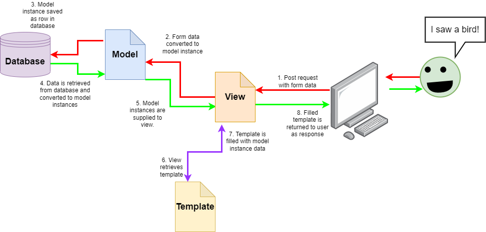
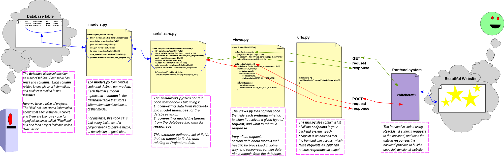

# DRF App Intro 

## Out With The Old

When you created your first app in Django, you were using Django as a **full-stack** platform. Django was handling everything, from the database, to the program logic, to presentation. When you use Django this way, you follow the **MVT** (*Model-View-Template*) design paradigm.

Here's how that app architecture might look for a full-stack Django app that lets ornithologists record sightings of rare birds:

This approach works great, but sometimes we run into some limitations. The `HTML` that you write in Django templates is a pretty simple specification language, and inserting fancy tools like Javascript to add more power can be clunky. The more functionality you try and eke out of it, the more complicated your code needs to become. 

## In With The New

The way we deal with complexity in computer science is to apply the [Single Responsibility Principle](https://en.wikipedia.org/wiki/Single-responsibility_principle). This says that each piece of code that we create should have exactly one job. The SRP makes it much easier to write code, and fix problems when they arise.

Here, that means that when our apps get more complex, we manage this complexity by breaking them in two: 
* We'll keep **Django** (with **Django Rest Framework**) to take care of the records that we store in the database, and any logic related to the creation, retrieval, and management of them. This is the **Back End**.
* We'll use **React** to take care of the presentation side of our website. It will generate the pages that the users see. This is the **Front End**.

Here's an example of what this architectural paradigm looks like, using the example of a charity app that helps dogs pay for their surgeries:

I've included a little more detail here because we'll be looking in depth at each of the elements of this app later on. But you might notice that the only major difference between a Full Stack Django app and a Back End Django Rest Framework app is that we've replaced our `templates.py` file with a `serializers.py` file!

## The API

Let's zoom in on the area between our DRF app and that mysterious purple box labelled `witchcraft`...

For now we don't need to know what happens inside the front end. We know that its job is going to be creating and managing the pages that our users see. That means that when our users do something that generates a request, they'll be talking to the front end.

What we do need to worry about right now is how the front end is going to pass those requests on to our DRF backend! We need a way for two computer programs to talk to one another. In computer science, this is called an **A**pplication **P**rogramming **I**nterface, or "**API**".

The end goal of our DRF app project will be to create an app that delivers this API for the front end to use. The front end should be able to pass a request to the back end (something like, *"list me all the crowdfunding projects!"* or, *"pledge a contribution to the 'Oliver's New Laptop' fund!"*), and the back end should execute that request, returning a useful response.

The particular type of API we'll be building is called a [**REST** API](https://www.redhat.com/en/topics/api/what-is-a-rest-api). This stands for **RE**presentational **S**tate **T**ransfer. REST APIs are useful because they are great at handling multiple requests from different users. They do this by being "*stateless*". This means they don't keep track of a user's information between interactions. Every request that gets sent to the API is totally self-sufficient, and doesn't need to refer to the requests that came before it to make sense. As a result, the back end doesn't need to juggle a lot of half-complete conversations.

## HTTP Messages

The requests and responses that our API will be dealing with follow a protocol called [**HTTP**](https://developer.mozilla.org/en-US/docs/Web/HTTP/Messages) (**H**yper**T**ext **T**ransfer **P**rotocol). The protocol is just a specified format for messages. If messages weren't in a uniform format it would be very difficult to write programs to deal with them!

When the user triggers behaviour in the front end, it sends a *request* to the back end. The back end does some work and replies with a *response*.

Let's look at the format of an HTTP request and response:

<object data="./img/request_response_cycle.pdf" type="application/pdf" width="700px" height="700px">
    <embed src="./img/request_response_cycle.pdf">
        
This browser does not support PDFs. Please download the PDF to view it: <a href="./img/request_response_cycle.pdf">Download PDF</a>.

    </embed>
</object>

