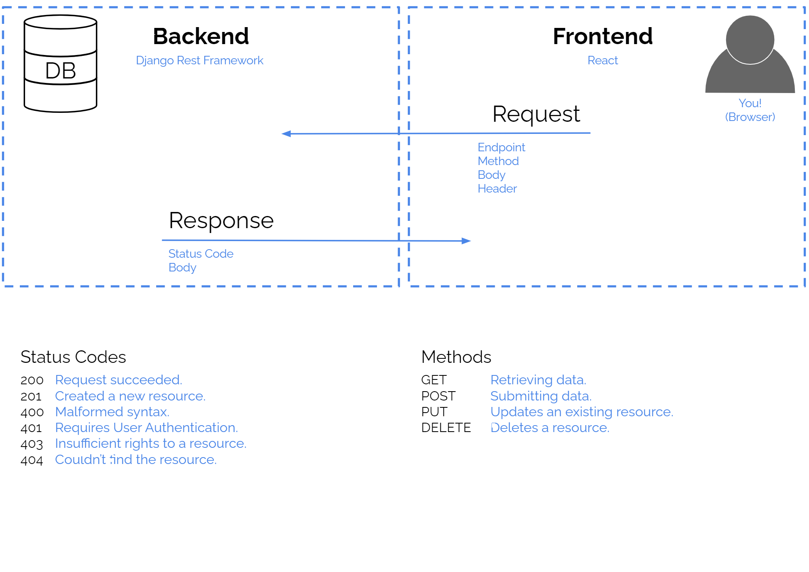
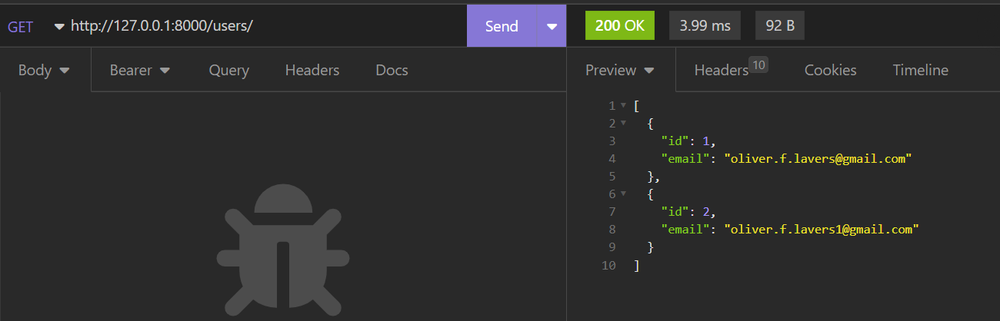
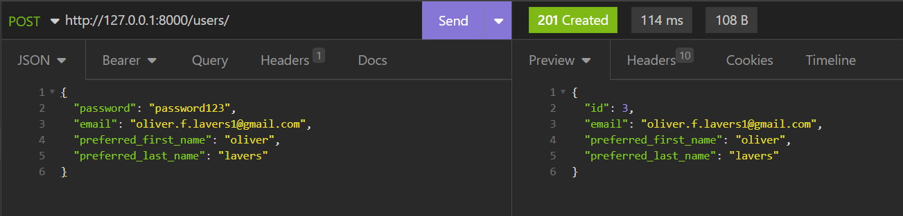

# DRF App Intro 

## Out With The Old

When you created your first app in Django, you were using Django as a **full-stack** platform. Django was handling everything, from the database, to the program logic, to presentation. When you use Django this way, you follow the **MVT** (*Model-View-Template*) design paradigm.

Here's how that app architecture might look for a full-stack Django app that lets ornithologists record sightings of rare birds:

This approach works great, but sometimes we run into some limitations. The `HTML` that you write in Django templates is a pretty simple specification language, and inserting fancy tools like Javascript to add more power can be clunky. The more functionality you try and eke out of it, the more complicated your code needs to become. 

## In With The New

The way we deal with complexity in computer science is to apply the [Single Responsibility Principle](https://en.wikipedia.org/wiki/Single-responsibility_principle). This says that each piece of code that we create should have exactly one job. The SRP makes it much easier to write code, and fix problems when they arise.

Here, that means that when our apps get more complex, we manage this complexity by breaking them in two: 
* We'll keep **Django** (with **Django Rest Framework**) to take care of the records that we store in the database, and any logic related to the creation, retrieval, and management of them. This is the **Back End**.
* We'll use **React** to take care of the presentation side of our website. It will generate the pages that the users see. This is the **Front End**.

Here's an example of what this architectural paradigm looks like, using the example of a charity app that helps dogs pay for their surgeries:

I've included a little more detail here because we'll be looking in depth at each of the elements of this app later on. But you might notice that the only major structural difference between a Full Stack Django app and a Back End Django Rest Framework app is that we've replaced our `templates.py` file with a `serializers.py` file!

### The Really Crucial Point
The big difference between what we did before and what we're doing now is that every element of our back-end DRF app is going to be focussed on making "**resources**" available to the front end. "Resources" almost always means **database records**. We want to give the front end a set of "levers" to create, modify and retrieve records, based on the activities of the users.

## Let's Brainstorm!
Take a moment to plan out the MVP of your project. Rather than digging into detailed wireframes just now, I recommend just plotting out what pages will be required and what the user will be able to do on each one of them. Feel free to sketch out some boxy frames for these pages, but don't go in-depth on how things will look.

## The Database
We'll be using a relational database for our projects. These databases have their own language (SQL - **S**tructured **Q**uery **L**anguage) and a whole constellation of programs for interacting with them, but great news: Django is going to handle almost all of it for us!

We still need to know a little bit about what Django is up to with the database, though.

A relational database is a lot like a super-powered Excel workbook, containing a bunch of tables. Each table has a series of rows, corresponding to individual records, and a set of columns. Each column records a single fact about each record. Crucially, each record has a **Primary Key** - an ID number that identifies it uniquely in its table. There's a good example of a database schema on Thinkific...

Have a think about what kinds of records need to be stored for your app. Each type of record is going to need a table, and each table will need a set of columns to describe the record. Have a go at sketching out a plan for your database tables now. Remember, this is just a draft, it's ok to change it later on!

## The API
Next let's zoom in on the area between our DRF app and that mysterious purple box labelled `witchcraft`...

For now we don't need to know what happens inside the front end. We know that its job is going to be creating and managing the pages that our users see. That means that when our users do something that generates a request, they'll be talking to the front end.

What we do need to worry about right now is how the front end is going to pass those requests on to our DRF backend! We need a way for two computer programs to talk to one another. In computer science, this is called an **A**pplication **P**rogramming **I**nterface, or "**API**".

The end goal of our DRF app project will be to create an app that delivers this API for the front end to use. The front end should be able to pass a request to the back end (something like, *"list me all the crowdfunding projects!"* or, *"pledge a contribution to the 'Oliver's New Laptop' fund!"*), and the back end should execute that request, returning a useful response.

### Endpoints
Each type of request will be directed to an **endpoint** - a URL linked to a view designed to serve that type of request.

An endpoint is just a fancy name for a URL in an API. It's not designed for users to access, it's designed for the frontend half of our app to interface with!

### REST

The particular type of API we'll be building is called a [**REST** API](https://www.redhat.com/en/topics/api/what-is-a-rest-api). This stands for **RE**presentational **S**tate **T**ransfer. REST APIs are useful because they are great at handling multiple requests from different users. They do this by being "*stateless*". This means they don't keep track of a user's information between interactions. Every request that gets sent to the API is totally self-sufficient, and doesn't need to refer to the requests that came before it to make sense. As a result, the back end doesn't need to juggle a lot of half-complete conversations.

## REST Verbs/HTTP Methods
REST APIs use a set of a few standard request types. These are called the **REST Verbs**. You may also hear them referred to as **HTTP Methods** or **HTTP Verbs**. They describe the different types of actions that the frontend might request from the backend. The main ones to know are:

### GET
  * Used for requesting information
  * Should not change the database contents
### POST
  * Used for creating new records
  * Implies that a new row is being created in a table
### PUT
  * Replaces an old record with a new one
### PATCH
  * Updates an existing record
### DELETE
  * Does what it says on the can. A row is removed from a table.

Have a think about what kinds of requests users will need to make at the API to achieve the MVP functionality of your app. Note these down - there's a good example of an API spec on Thinkific.

## HTTP Messages
The requests and responses that our API will be dealing with follow a protocol called [**HTTP**](https://developer.mozilla.org/en-US/docs/Web/HTTP/Messages) (**H**yper**T**ext **T**ransfer **P**rotocol). The protocol is just a specified format for messages. If messages weren't in a uniform format it would be very difficult to write programs to deal with them!

When the user triggers behaviour in the front end, it sends a *request* to the back end. The back end does some work and replies with a *response*.

Let's look at the format of an HTTP request and response - there's a great diagram on thinkific. We'll discuss this in some detail in class.

First, let's run an example fullstack app, and take a look at the requests it is sending and the responses it is receiving...

[Bird App](http://127.0.0.1:8000/sightings/)

Now, let's look at what those responses might look like from a backend app...

### Get Request

### Post Request

## JSON
This is the last acronym for today, I promise. It stands for **J**ava**S**cript **O**bject **N**otation, but don't let that *Javascript* word fool you - JSON is actually used almost universally as a way to transfer data.

When we're manipulating objects in Python, they're stored in our computer's memory as `0`'s and `1`'s. The Python interpreter has it's own way of storing and manipulating them, but this format is unique to Python. Your web browser doesn't run Python, so if we sent these objects over to it as-is, it wouldn't understand us. 

Instead, we need to convert the data into a format that is simple enough to send over-the-wire, and clear enough that it can be read by both humans and computers. JSON is this. 

So we need to learn a whole new language? NOPE! Because Python is excellent, the developers foresaw the need for JSON, and they built their data structures to mimic it. JSON `objects` have the same structure as Python dictionaries, and JSON `arrays` mirror Python lists. Those are the only two structures in JSON. You already know it!

So, for our REST API, the *body* element of our HTTP requests and responses will be in JSON format. We'll have a few lines of code in each of our views dedicated to converting JSON to Python, and back.

## What Now?
Ok, that's a lot of info. But you made it! 

The plan from here on out is for us to run through the process of building an API together using DRF. Next lesson we'll start building the app from the ground up, and as we move through the process we will focus in on each of the elements in that architectural diagram up the top, learning about it in detail.

Your homework is to send your MVP plan to me by Saturday. Take a look at the project requirements on Thinkific.