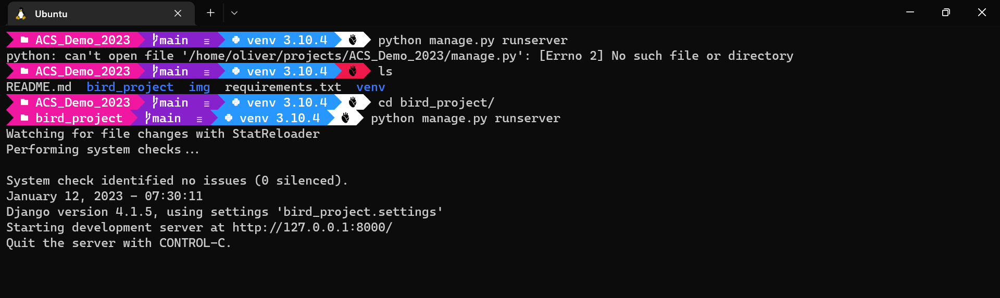

# No, a peripheral tech tool is not what you get when Oliver stands near the edge of a group of programmers.

I'm talking about useful programs, languages, and skills that help you do your job, even if they aren't the main thing you do!

## Table of Contents
- [Markdown](#markdown)
- [WSL 2](#wsl-2)


## [Markdown](https://docs.github.com/en/get-started/writing-on-github/getting-started-with-writing-and-formatting-on-github/basic-writing-and-formatting-syntax)
Oh boy, `Markdown` is the best, and if you're not using it you're missing out. 

`Markdown` is a handy, extremely lightweight language for structuring web-pages. It's similar to `HTML`, but it's designed to be just as easy to read in code-form as it is when it's rendered as a web-page. 

Basically it's just a handful of extra punctuation that you can sprinkle into a text file so that when a browser opens that file, it will appear as a nice-looking, formatted page. For example, the guide you're reading right now was prepared in `Markdown`. That's right, **if you include a file with the `.md` file suffix in your repo, Github will automatically render it into a web-page for you**. 

It's amazing.

You can do language-aware codeblocks:

```Python
def foo(bar):
    return {
        "hi": "hello"
    }
```
You can also do images, links, dot-points, headings, tables... you name it. And it takes the same time to write as it would to just type the text content of your page into an editor. 

Also look how pretty it lets you make your terminal:


> Disclaimer - I spend an entire day making it look this good, and some of the stuff I did can be done in regular old windows. But seriously check it out, the little heart symbol turns red when an error occurs!

Get on it!

## [WSL 2](https://en.wikipedia.org/wiki/Windows_Subsystem_for_Linux)

This one's just for the Windows users. 

You know how annoying it is to be working through a tutorial, and then halfway through find out that it was written for people using Mac/Linux machines, and none of the terminal commands work for you? Worry no more!

`WSL 2` is a part of the Windows operating system that is disabled by default. "WSL" stands for **W**indows **S**ubsystem for **L**inux. It will let you use your windows machine as a Linux computer. That means that all those fancy Bash shell commands will work even better for you than they will for Mac owners.

I cannot stress enough how much this simplifies the development process. When I started using `WSL` it was a revelation. The hard truth is that whenever you deploy your website to let others use it, you'll be deploying it onto a system that runs some flavour of Linux. Developing your code in that system makes things much smoother. Plus, the Linux terminal makes every other command line interface seem clunky in comparison. It's so quick to set up! [Check out the guide I wrote](https://github.com/Hauteclere/wsl2_walkthrough).