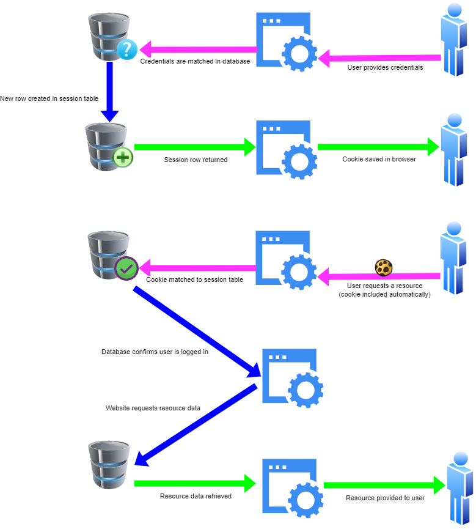

# Permissions and Authentication
The big theoretical take-away from this class was to do with **Token Authentication**, so let's take a little time here to remind ourselves what that is and why we need it.

First let's look at the alternative; the type of authentication we *won't* be using:

## Session Auth
Under session authentication, the database stores a table of people who are currenlt logged in. If a new user hands over their username and password, the website creates a log of the event in this table (literally, *logs* them in). When someone logs out, the record is deleted.

Once you're logged in, the website issues a scrap of data to you called a `Session Cookie` that you can send through to prove your identity in future interactions. This is really just a little file that identifies your session record in the table - **it's the equivalent of walking up to an exclusive clubhouse and saying to the bouncer "I'm on the list"**. If you log out and then provide the same cookie again, the row in the database will have been deleted, and the website will know you're lying about being logged in.

### Why This Won't Work For Us
The main reason we seldom use this system in modern websites is that it isn't very *scalable*. Every single logged user has to be stored in a single table in a single database. This can make the website slow, because thousands of users from all over the world are competing to send their session cookies in to be verified. 

It would be better to have multiple databases to share the load, with requests being routed to the one that happens to be quietest right now. But then we run into the problem where my session record is stored in the database at the Belconnen datacentre, but the server that took my request is looking for is in the US-East datacentre...

## Token Authentication To The Rescue
We need a way to prove our identity without having to hit the database.

The way we'll accomplish this is by using a little bit of *cryptography*. When a user provides their credentials to us, we will check that they're correct by looking in th database like normal. But then instead of recording them in a table in the database, we will do some magic.

We'll write down their username and any other info we think is important (typically, who we are, what the current time is, when the login should expire, etc), and encrypt it with a secret key that only we know. We'll give the encrypted data back to the user. This packet of encrypted data is called a `Token`. Because the users don't have the secret key, they can't read it or fake up their own version; they just have to hang onto it.

Then when the user wants to access a resource, they give us back a copy of the token. We decrypt it, and if it looks correct, we believe the user when they say they're logged in. **This is a bit like showing up to a private clubhouse and showing your members' card at the door - the bouncer looks at the card, and if it looks right, they let you in. They don't check a members list, because just having the card is enough proof.**

### Why This Is Better
This takes a significant load off our database. Plus, now if we want to, we can split our databases up by topic - we can have one for login, one for user info, one for pledges, etc... This is possible now because it's not longer the case that every single request has to be checked against the session table!

### Downsides
No system is perfect. In particular, this system makes it hard to log somebody out. After all, we aren't keeping a list of who is logged in - anyone with a valid token is considered to be logged in!

We can definitely tell people to destroy their token when they want to log out, and that's the standard technique. But if we want to come up with a way of logging a user out of their account globally, on every device...? Then we run into some trouble. 
- It's possible to keep a blacklist. This is bad, because it would require a hit to the blacklist table every time someone accessed a resource >:( 
- We can start using a new secret code for encrypting the tokens. This is painful because it logs everyone out everywhere. :'(

The best solution is to just not get into a position where people need to be logged out globally in the first place. So that's what we tend to do.